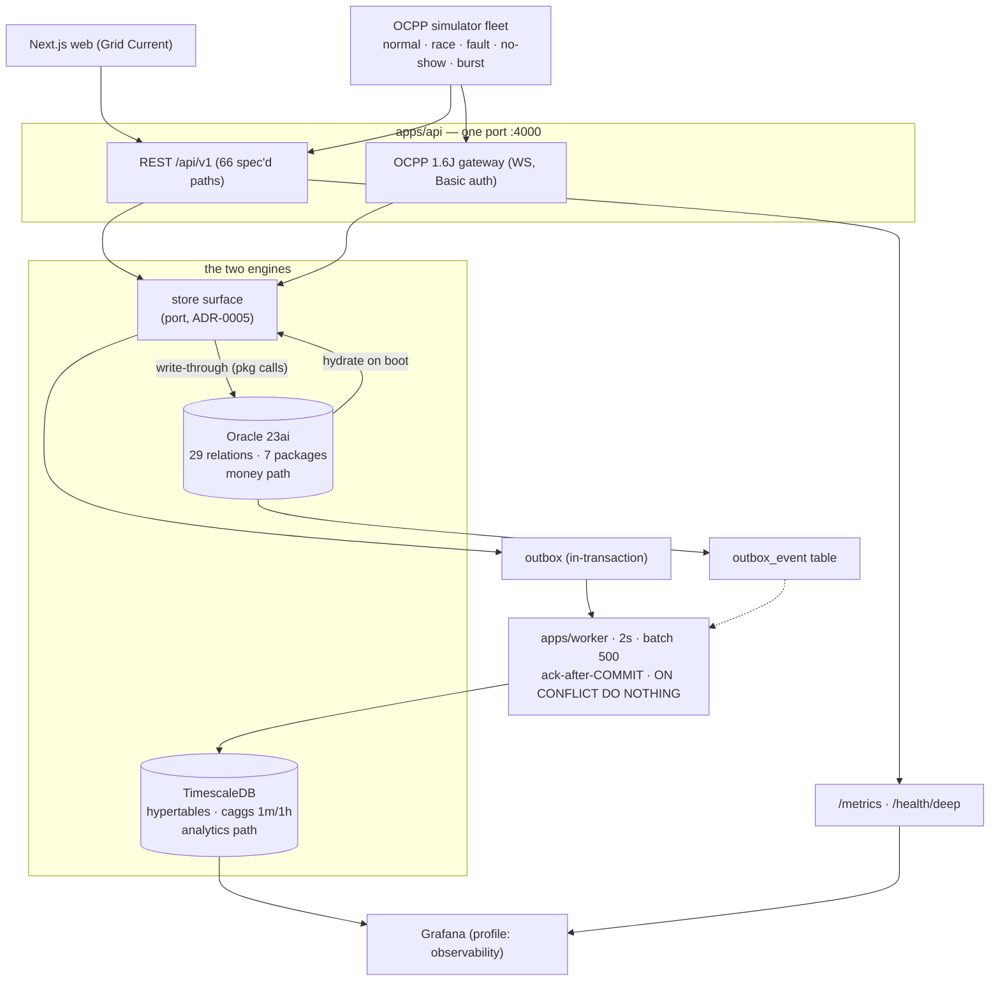
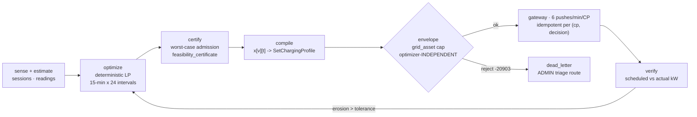

# VoltHub CSMS — Architecture (1 page)

## The shape

A **modular monolith + one worker** (ADR-0001). Express API and the OCPP WebSocket gateway share one port; a 2-second relay worker moves telemetry events from the OLTP engine to the time-series engine. No microservices, no brokers, no cache tier — every simplification is a documented decision, not an omission.

## The three seams that hold it together

1. **Store port (ADR-0005):** every route is written against `createStore()`'s method surface. `store.js` is the documented local test double; `db/oracle.js` wraps the same object with write-through PL/SQL package calls. Tests run hermetic locally and against real Oracle in CI (`STORE=oracle`).
2. **Outbox pipeline (ADR-0003):** `meter_reading` + `outbox_event` commit atomically inside one package call; the relay delivers at-least-once and the sink dedupes (idempotent replay), so billing never depends on TimescaleDB being up.
3. **Error-band contract (`src/errors.js`):** `ORA-20501…209xx` → HTTP `422/409/402/…` mapped once; identical bands raised by `RAISE_APPLICATION_ERROR` in PL/SQL and mirrored in JS.

## Key decisions (ADR index)

| ADR  | Decision                  | One-line reason                                                                            |
| ---- | ------------------------- | ------------------------------------------------------------------------------------------ |
| 0001 | Modular monolith          | Money invariants stay in one transaction boundary; sagas would hide the graded correctness |
| 0002 | TimescaleDB for telemetry | Ticks are append-heavy/immutable/window-read; matrix score 4.90 vs InfluxDB 3.95           |
| 0003 | Outbox + relay            | Atomic-with-write publication; dual-write diverges on crash; CDC too heavy for scope       |
| 0004 | Plain JS + Express        | Zero-build velocity; contracts carried by OpenAPI drift gate + tests, not types            |
| 0005 | Hexagonal store           | Replacement, not rewrite: routes unchanged between engines; hermetic tests preserved       |
| 0014 | Control-loop closure      | A loop whose certify/verify stages are test-only is a diagram, not a mechanism             |
| 0006 | Connector FK-native       | Display handles (`cp_id:connector_no`) stop being the only truth; joins stop being LIKE    |
| 0007 | OCPP remote commands      | CSMS→CP calls share one registry + uid plumbing instead of three ad-hoc senders            |
| 0008 | AI as advisory sidecar    | A model between a driver and a breaker is unauditable; deterministic LP owns constraints   |
| 0009 | Multi-tenancy (deferred)  | Retrofitting tenancy is rewrite-grade; designed in ADR-0009, started only with a tenant    |
| 0010 | FC-HCC control loop       | Sensing without actuation makes every smart-charging claim unfalsifiable                   |
| 0011 | Control-path integrity    | The envelope must not consult the optimizer it constrains (failure independence)           |
| 0012 | Twin profile compliance   | A twin that always obeys validates nothing; it must honor — or honestly ignore — profiles  |
| 0013 | Benchmark methodology     | A methodology decided after results exist is not a methodology                             |

## The control path (the part that acts)

Per-site mode is `OFF | ADVISORY | ENFORCED`, default **OFF** — actuation is opt-in per
site, and `ENFORCED` requires an ACTIVE SITE grid asset (an envelope without a certified
cap is a hope).

Certification runs **before** scheduling and is graded **after** it: the promise is a
persisted row, the plan must honour its floor, the acks are correlated, and metered kW
is compared against the schedule in force. Where the promise is not yet kept — target SoC
above the CC-CV knee — the benchmark says so (ADR-0014, `docs/perf.md`).

## Where it deliberately stops (scale exits, not features)

- Multi-VM ⇒ the Maps read-cache becomes read-through (and Redis becomes justified).
- > 50 charge points/VM ⇒ shard the OCPP gateway by identity hash.
- Any of these is measurable first (`bench/`), decided second.
