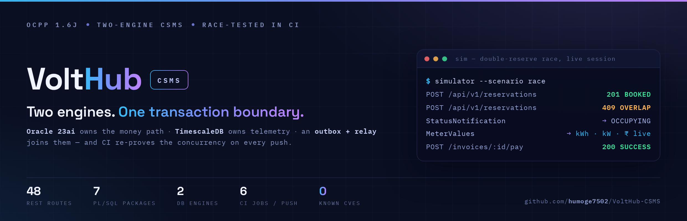
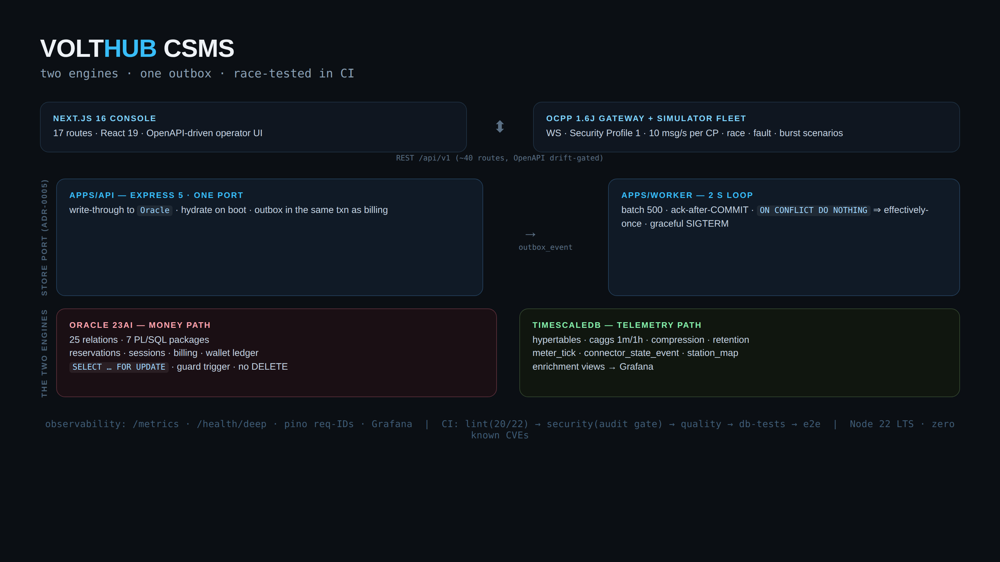
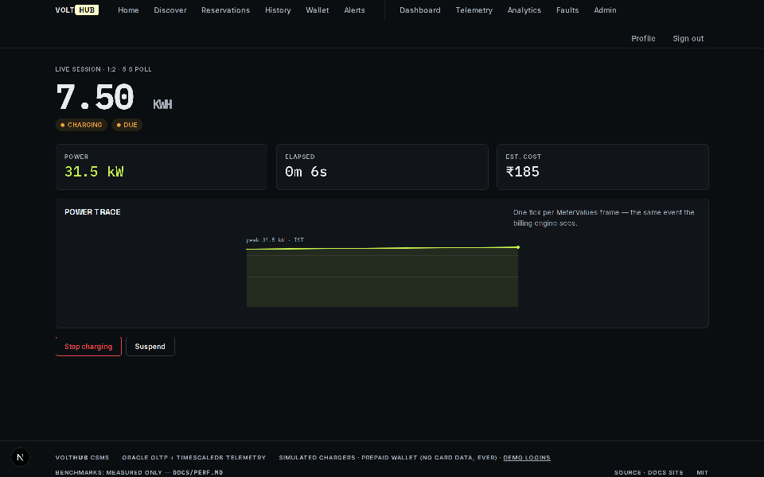
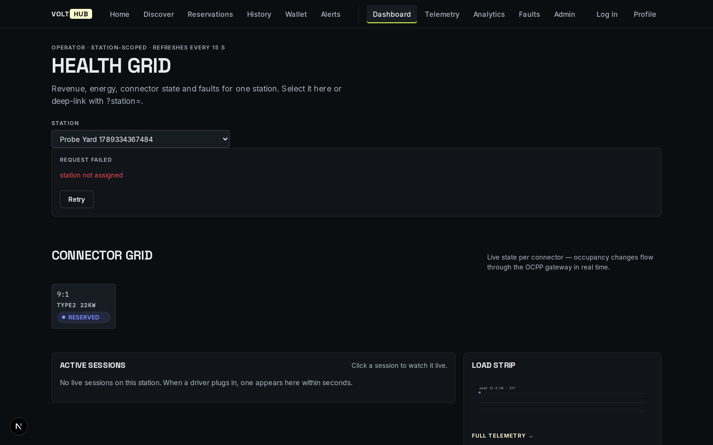
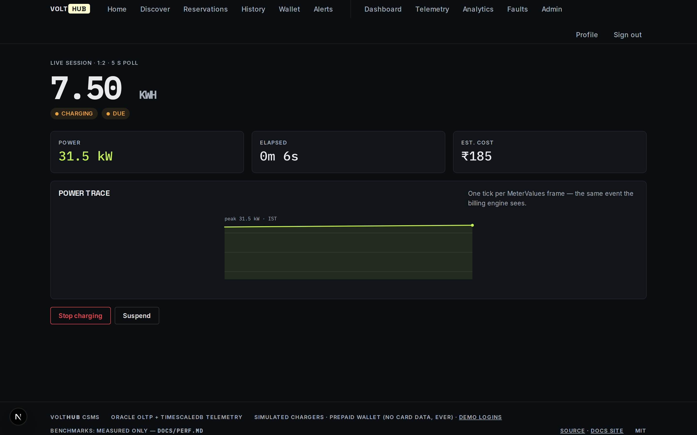
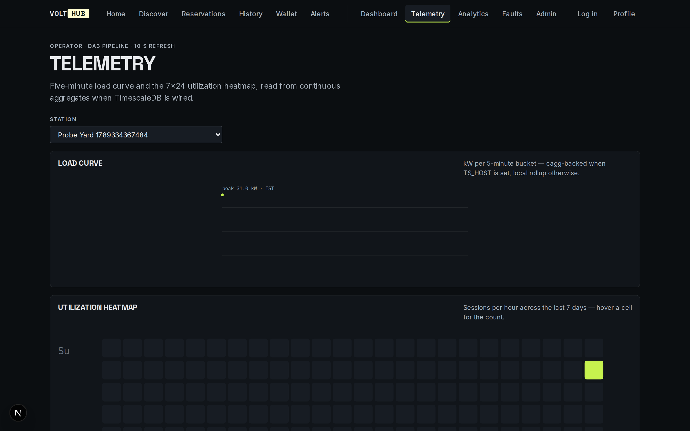
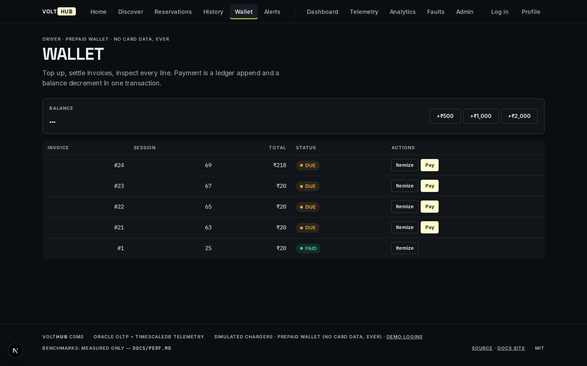
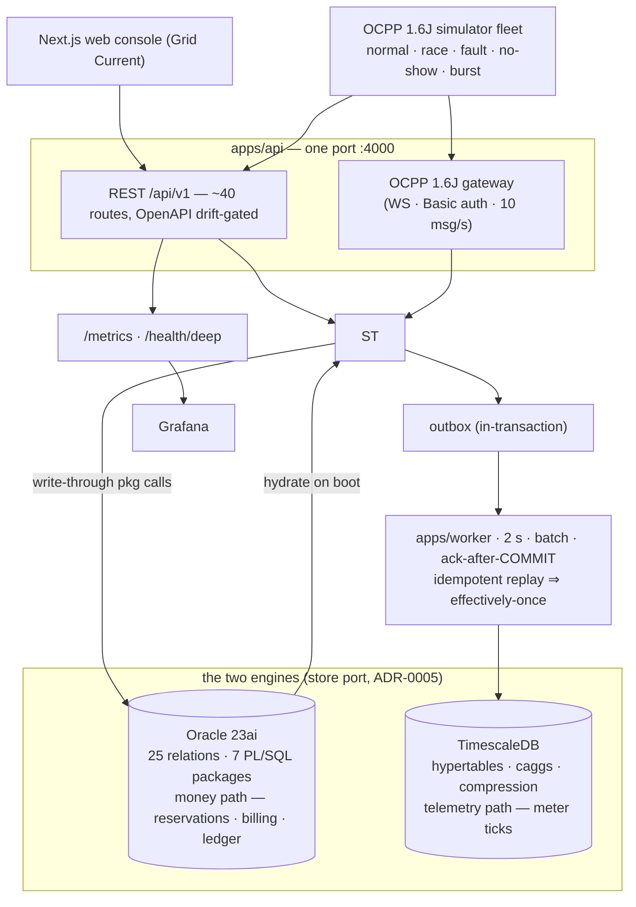

<div align="center">
  
</div>

**Two-engine EV charging management: Oracle for ACID billing/reservations, TimescaleDB for telemetry — driven by an OCPP 1.6J gateway + simulator fleet, race-tested in CI on both database engines, with a typography-led Next.js operations console.**

<div align="center">

[](https://github.com/humoge7502/VoltHub-CSMS/actions/workflows/ci.yml)
[](https://github.com/humoge7502/VoltHub-CSMS/actions/workflows/release.yml)
[](https://codecov.io/gh/humoge7502/VoltHub-CSMS)
[](https://scorecard.dev/viewer.html?url=github.com/humoge7502/VoltHub-CSMS)
[](https://deepwiki.com/humoge7502/VoltHub-CSMS)


[](https://humoge7502.github.io/VoltHub-CSMS/)

</div>

> **New here? Pick a 5-minute path.**
>
> | You are…                   | Read, in this order                                                                                                                                                                                           |
> | -------------------------- | ------------------------------------------------------------------------------------------------------------------------------------------------------------------------------------------------------------- |
> | 🧭 **Recruiter / curious** | the [30-second demo](#30-second-demo) below → [What's actually here](#whats-actually-here) → the [docs site](https://humoge7502.github.io/VoltHub-CSMS/) → [`docs/resume-bullets.md`](docs/resume-bullets.md) |
> | 🔧 **Engineer**            | [Quickstart](#quickstart) → [`ARCHITECTURE.md`](ARCHITECTURE.md) → [ADR index](docs/adr/) → run the [race suite](apps/api/test/race.js) yourself                                                              |
> | 🔍 **Reviewer / sceptic**  | [ADRs](docs/adr/) (trade-offs named) → [`docs/verification.md`](docs/verification.md) (every claim has a receipt) → [`docs/perf.md`](docs/perf.md) (numbers, methodology) → [`SECURITY.md`](SECURITY.md)      |

|              **48**              |              **2**               |             **7**              |         **7**          |         **6**         |             **0**             |
| :------------------------------: | :------------------------------: | :----------------------------: | :--------------------: | :-------------------: | :---------------------------: |
| REST routes, OpenAPI drift-gated | DB engines behind one store port | PL/SQL packages own the writes | ADRs, trade-offs named | CI jobs on every push | known CVEs, `npm audit` gated |

<p align="center">
  
</p>

<p align="center">
  
  <br>
  <em>Live session — real OCPP MeterValues tick the UI (re-record anytime: <code>scripts/screenshots/</code> — see its README).</em>
</p>

<p align="center">
  
  
  <br>
  
  
  <br>
  <em>Real pixels from the running stack (API :4000 + OCPP 1.6J WebSocket session + web console). More at the <a href="https://humoge7502.github.io/VoltHub-CSMS/">documentation site</a>.</em>
</p>

## 30-second demo

> Two terminals reserve the same connector → one `201 BOOKED`, one `409 OVERLAP` → plug-in → live kWh/kW/cost → itemized invoice → wallet pay. (Record the terminal race with `scripts/demo.sh`.)

## Stack, and why (trade-offs, not fashion)

| Choice                                                | Why (and the trade-off accepted)                                                                                                                                                                                         |
| ----------------------------------------------------- | ------------------------------------------------------------------------------------------------------------------------------------------------------------------------------------------------------------------------ |
| **Oracle 23ai** for the money path                    | row-lock semantics + PL/SQL packages own the writes (guard trigger blocks direct `connector.status` UPDATEs). Trade-off: a real Oracle dependency — CI runs it as a service container every push                         |
| **TimescaleDB** for telemetry                         | 90 %+ of rows are immutable time-ordered ticks — hypertables/caggs/compression are the right shape. Trade-off: caggs can only query one hypertable, so enrichment is query-time views + a relay-maintained `station_map` |
| **outbox + relay** between them                       | same-transaction outbox on Oracle + ack-after-COMMIT relay gives effectively-once without a broker. Trade-off: single-writer worker, not a fan-out bus                                                                   |
| **Express 5 + pino 10**                               | boring, dependency-light API core; request-ID error envelopes; drift-gated OpenAPI. Trade-off: hand-rolled middlewares instead of a framework galaxy                                                                     |
| **Next.js 16 + React 19**                             | App Router with real client components; CSP set at the Next layer. Trade-off: server/client boundary discipline is on the team                                                                                           |
| **Node 22 LTS**                                       | CI runs a 20/22 matrix so `engines >=20` stays honest; images ship 22                                                                                                                                                    |
| **eslint 10 flat config + prettier + npm audit gate** | the lint gate is deliberately stricter than the pre-flat era (it immediately caught two latent issues); `npm audit` fails CI on either lockfile                                                                          |
| **c8 coverage → Codecov** (informational)             | the coverage badge is a receipt, not a target — unit-tier suites instrumented with V8 coverage on every push; DB-backed suites stay in `db-tests` on purpose                                                             |
| **Compose + Caddy, one VM**                           | honest deploy target (ADR-0001); graceful SIGTERM drains matched to compose stop-grace periods. Trade-off: no K8s story by design                                                                                        |

## Why two databases (4 lines)

- Sessions/billing are ACID-relational (money path, overlap exclusion, ledger) → **Oracle 23ai**, with the money logic in PL/SQL packages (`RESERVATION_PKG`, `CHARGE_SESSION_PKG`, `BILLING_PKG`) — not in app code.
- 90%+ of rows are immutable, time-ordered meter ticks read as window aggregates — the wrong shape for a row-store → **TimescaleDB** hypertables + 1m/1h continuous aggregates + 7-day compression + 90-day retention.
- Same event, two resolutions: every OCPP `MeterValues` writes `METER_READING` (billing record, Oracle) **and** `meter_tick` (analytics record, Timescale) via an **outbox + relay** (at-least-once delivery, idempotent replay = effectively-once).
- Race safety is proven, not claimed: CI fires parallel double-reserves and double-pays and asserts exactly one winner — against the in-process store **and** against real Oracle row locks.

## System at a glance



Mermaid renders natively on GitHub. Full 1-page version + ADR table: [`ARCHITECTURE.md`](ARCHITECTURE.md).

## What's actually here

| Layer            | Evidence                                                                                                                                                                                                              |
| ---------------- | --------------------------------------------------------------------------------------------------------------------------------------------------------------------------------------------------------------------- |
| **Oracle OLTP**  | 25-relation BCNF-honest schema, 7 PL/SQL packages, connector-state guard trigger, least-privilege role (no DELETE anywhere), MV + scheduler — `db/oracle/V001–V006`                                                   |
| **Concurrency**  | `SELECT … FOR UPDATE` / `SKIP LOCKED` bulk expiry, error bands `-2050x…-209xx` mapped to HTTP once (`src/errors.js`), race suites in CI on both engines — `apps/api/test/race.js`                                     |
| **OCPP 1.6J**    | WebSocket gateway with HTTP Basic auth on upgrade (Security Profile 1), per-CP credentials, 10 msg/s limit, 7 core messages + monotonic tick sequencing — `apps/api/src/ocpp/gateway.js`                              |
| **DA3 pipeline** | Outbox → 2s relay → hypertables → caggs; crash-after-COPY replays safely — `apps/worker/`, `db/timescale/`                                                                                                            |
| **API**          | 48 spec'd REST routes, OpenAPI 3.0 with a CI **drift gate**, Idempotency-Key replay, keyset pagination, request-ID error envelopes — `apps/api/src/`                                                                  |
| **Web**          | 17 routes, "Grid Current" design system (Space Grotesk / IBM Plex Mono tabular numerals), zero chart dependencies, unified PageState + toasts + URL-as-state — `apps/web/`                                            |
| **CI**           | 6 jobs: lint (Node 20/22 matrix) · security (npm audit gate, both lockfiles) · quality · coverage (c8 → Codecov) · db-tests (Oracle + Timescale service containers) · e2e (full compose) — `.github/workflows/ci.yml` |
| **Releases**     | tag-driven GitHub Releases with notes extracted from a Keep-a-Changelog `CHANGELOG.md`; conventional commits throughout — `.github/workflows/release.yml`                                                             |

## Honest limits

- The **local profile** (no Docker) runs an in-process store mirroring package semantics for fast iteration/tests; `ORACLE_HOST`/`TS_HOST` arms the durable two-engine path (ADR-0005).
- Chargers are **simulated** (SteVe precedent — real hardware interop is out of scope); payments are a **prepaid wallet** (no card data, ever); single-VM Compose, not K8s (ADR-0001).
- OCPP scope is the **1.6J core profile** (Boot/Heartbeat/Status/Authorize/Start/Meter/Stop); DataTransfer/diagnostics/firmware management are deliberately out of scope. Migration path to OCPP 2.0.1 (IEC 63584): `TransactionEvent` replaces Start/Meter/Stop — the store surface is protocol-neutral by design.
- No performance numbers are claimed here — **see `docs/perf.md`** (methodology + 5 reproducible experiments; measured tables land from `bench/` scripts only).

## Quickstart

```bash
# 1) local, no Docker: API :4000 + web :3000
npm install
npm run dev:api &                      # seeded demo data, /api/v1/health
cd apps/web && npm install && npm run dev

# 2) full stack (Oracle 23ai + TimescaleDB containers)
docker compose -f infra/docker-compose.yml up --build

# 3) races + tests + coverage
npm run test -w apps/api && npm run test:race -w apps/api
npm run coverage                       # c8 line coverage over the unit-tier suites
node apps/simulator/src/index.js --scenario race   # expect exactly one 201 + one 409
```

Demo logins: `admin@volthub.in` / `Admin@123` · `arjun@volthub.in` / `Operator@123` · any seeded driver / `Driver@123`.

## Status & releases

- Current release: **[v1.4.0](https://github.com/humoge7502/VoltHub-CSMS/releases)** — tagged releases carry notes extracted from [`CHANGELOG.md`](CHANGELOG.md) (Keep-a-Changelog / SemVer).
- Engineering history is fully auditable: conventional-commit breadcrumbs (`fix(oracle): …`, `ci(e2e): …`) — including the failures and their fixes.
- Roadmap notes (OCPP 2.0.1 migration path, scale exits): [`ARCHITECTURE.md`](ARCHITECTURE.md) · [`docs/masterplan/18-da-plans-and-roadmap.md`](docs/masterplan/18-da-plans-and-roadmap.md).

## Docs map

| What                              | Where                                                                                                                                                                                                  |
| --------------------------------- | ------------------------------------------------------------------------------------------------------------------------------------------------------------------------------------------------------ |
| **Docs site (Pages)**             | [humoge7502.github.io/VoltHub-CSMS](https://humoge7502.github.io/VoltHub-CSMS/) — 1-page visual tour of this repo                                                                                      |
| Masterplan (DA1→DA2→DA3)          | `docs/masterplan/` + polished PDF `docs/VoltHub-CSMS-Engineering-Masterplan.pdf`                                                                                                                       |
| Architecture (1 page + diagram)   | `ARCHITECTURE.md`                                                                                                                                                                                      |
| Decision records                  | `docs/adr/0001` modular monolith · `0002` TimescaleDB (4.90/5) · `0003` outbox pipeline · `0004` plain-JS divergence · `0005` store adapter · `0006` connector FK-native · `0007` OCPP remote commands |
| Security posture                  | `SECURITY.md`                                                                                                                                                                                          |
| Contributing (the full bar)       | `CONTRIBUTING.md` — testing ladder, ground rules, ADR-first changes                                                                                                                                    |
| Performance methodology           | `docs/perf.md`                                                                                                                                                                                         |
| REST contract (OpenAPI 3.0)       | [`docs/openapi.json`](docs/openapi.json) — 48 paths / 52 operations, static snapshot of the live `/api/v1/docs` spec, drift-gated against routes in CI                                                 |
| Demo beats                        | `docs/demo-script.md`                                                                                                                                                                                  |
| ER / architecture / race diagrams | `diagrams/*.mmd` (Mermaid)                                                                                                                                                                             |
| Verification receipts             | `docs/verification.md` (every claim names what actually ran)                                                                                                                                           |

## License

MIT.

---

> **Also building [Q-Trust](https://github.com/humoge7502/q-trust)** — post-quantum
> cryptography migration & attestation: CBOM scanning, NIST/CNSA 2.0 scoring, GNN-ranked
> migration planning, attestations sealed on Base L2. The two projects share one
> discipline: _trade-offs named, claims receipted, races proven in CI._
