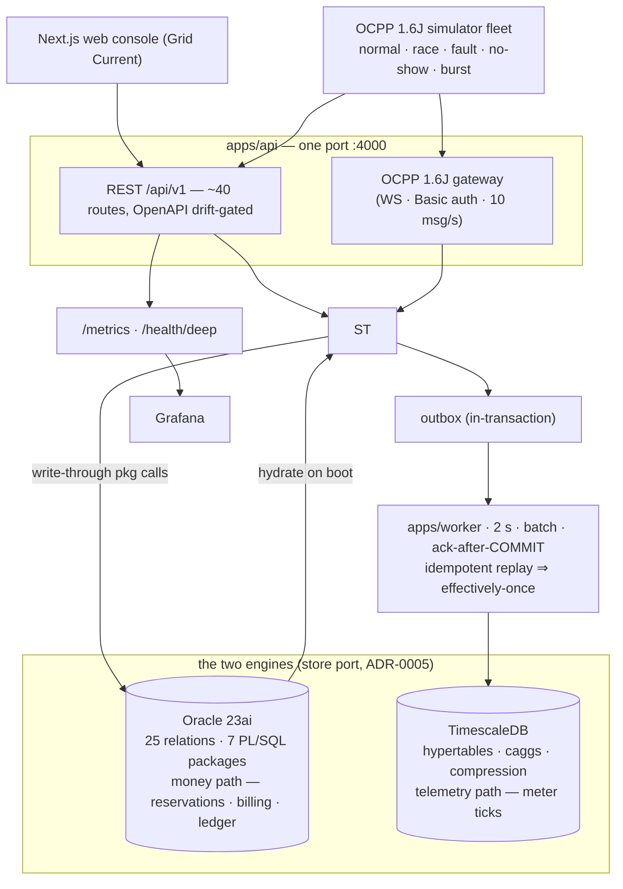

# VoltHub CSMS

**Two-engine EV charging management: Oracle for ACID billing/reservations, TimescaleDB for telemetry — driven by an OCPP 1.6J gateway + simulator fleet, race-tested in CI on both database engines, with a typography-led Next.js operations console.**

   `oracle-23ai` `timescaledb` `modular-monolith` `ocpp-1.6j` `nextjs`

<p align="center">
  
  
  <br>
  
  
  <br>
  <em>Real pixels from the running stack (API :4000 + OCPP 1.6J WebSocket session + web console).</em>
</p>

<p align="center">
  
  <br>
  <em>Live session — real OCPP MeterValues tick the UI (re-record anytime: `scripts/screenshots/` — see its README).</em>
</p>

> **30-second demo:** two terminals reserve the same connector → one `201 BOOKED`, one `409 OVERLAP` → plug-in → live kWh/kW/cost → itemized invoice → wallet pay. (Record the terminal race with `scripts/demo.sh`.)

## Why two databases (4 lines)

- Sessions/billing are ACID-relational (money path, overlap exclusion, ledger) → **Oracle 23ai**, with the money logic in PL/SQL packages (`RESERVATION_PKG`, `CHARGE_SESSION_PKG`, `BILLING_PKG`) — not in app code.
- 90%+ of rows are immutable, time-ordered meter ticks read as window aggregates — the wrong shape for a row-store → **TimescaleDB** hypertables + 1m/1h continuous aggregates + 7-day compression + 90-day retention.
- Same event, two resolutions: every OCPP `MeterValues` writes `METER_READING` (billing record, Oracle) **and** `meter_tick` (analytics record, Timescale) via an **outbox + relay** (at-least-once delivery, idempotent replay = effectively-once).
- Race safety is proven, not claimed: CI fires parallel double-reserves and double-pays and asserts exactly one winner — against the in-process store **and** against real Oracle row locks.

## System at a glance



Mermaid renders natively on GitHub. Full 1-page version + ADR table: [`ARCHITECTURE.md`](ARCHITECTURE.md).

## What's actually here

| Layer            | Evidence                                                                                                                                                                                 |
| ---------------- | ---------------------------------------------------------------------------------------------------------------------------------------------------------------------------------------- |
| **Oracle OLTP**  | 25-relation BCNF-honest schema, 7 PL/SQL packages, connector-state guard trigger, least-privilege role (no DELETE anywhere), MV + scheduler — `db/oracle/V001–V005`                      |
| **Concurrency**  | `SELECT … FOR UPDATE` / `SKIP LOCKED` bulk expiry, error bands `-2050x…-209xx` mapped to HTTP once (`src/errors.js`), race suites in CI on both engines — `apps/api/test/race.js`        |
| **OCPP 1.6J**    | WebSocket gateway with HTTP Basic auth on upgrade (Security Profile 1), per-CP credentials, 10 msg/s limit, 7 core messages + monotonic tick sequencing — `apps/api/src/ocpp/gateway.js` |
| **DA3 pipeline** | Outbox → 2s relay → hypertables → caggs; crash-after-COPY replays safely — `apps/worker/`, `db/timescale/`                                                                               |
| **API**          | ~40 REST routes, OpenAPI 3.0 with a CI **drift gate**, Idempotency-Key replay, keyset pagination, request-ID error envelopes — `apps/api/src/`                                           |
| **Web**          | 17 routes, "Grid Current" design system (Space Grotesk / IBM Plex Mono tabular numerals), zero chart dependencies, unified PageState + toasts + URL-as-state — `apps/web/`               |
| **CI**           | 3 jobs: quality · db-tests (Oracle + Timescale service containers) · e2e (full compose) — `.github/workflows/ci.yml`                                                                     |

## Honest limits

- The **local profile** (no Docker) runs an in-process store mirroring package semantics for fast iteration/tests; `ORACLE_HOST`/`TS_HOST` arms the durable two-engine path (ADR-0005).
- Chargers are **simulated** (SteVe precedent — real hardware interop is out of scope); payments are a **prepaid wallet** (no card data, ever); single-VM Compose, not K8s (ADR-0001).
- OCPP scope is the **1.6J core profile** (Boot/Heartbeat/Status/Authorize/Start/Meter/Stop); DataTransfer/diagnostics/firmware management are deliberately out of scope. Migration path to OCPP 2.0.1 (IEC 63584): `TransactionEvent` replaces Start/Meter/Stop — the store surface is protocol-neutral by design.
- No performance numbers are claimed here — **see `docs/perf.md`** (methodology + 5 reproducible experiments; measured tables land from `bench/` scripts only).

## Quickstart

```bash
# 1) local, no Docker: API :4000 + web :3000
npm install
npm run dev:api &                      # seeded demo data, /api/v1/health
cd apps/web && npm install && npm run dev

# 2) full stack (Oracle 23ai + TimescaleDB containers)
docker compose -f infra/docker-compose.yml up --build

# 3) races + tests
npm run test -w apps/api && npm run test:race -w apps/api
node apps/simulator/src/index.js --scenario race   # expect exactly one 201 + one 409
```

Demo logins: `admin@volthub.in` / `Admin@123` · `arjun@volthub.in` / `Operator@123` · any seeded driver / `Driver@123`.

## Docs map

| What                              | Where                                                                                                                                                                                                  |
| --------------------------------- | ------------------------------------------------------------------------------------------------------------------------------------------------------------------------------------------------------ |
| Masterplan (DA1→DA2→DA3)          | `docs/masterplan/` + polished PDF `docs/VoltHub-CSMS-Engineering-Masterplan.pdf`                                                                                                                       |
| Architecture (1 page + diagram)   | `ARCHITECTURE.md`                                                                                                                                                                                      |
| Decision records                  | `docs/adr/0001` modular monolith · `0002` TimescaleDB (4.90/5) · `0003` outbox pipeline · `0004` plain-JS divergence · `0005` store adapter · `0006` connector FK-native · `0007` OCPP remote commands |
| Security posture                  | `SECURITY.md`                                                                                                                                                                                          |
| Performance methodology           | `docs/perf.md`                                                                                                                                                                                         |
| Demo beats                        | `docs/demo-script.md`                                                                                                                                                                                  |
| ER / architecture / race diagrams | `diagrams/*.mmd` (Mermaid)                                                                                                                                                                             |

## License

MIT.
